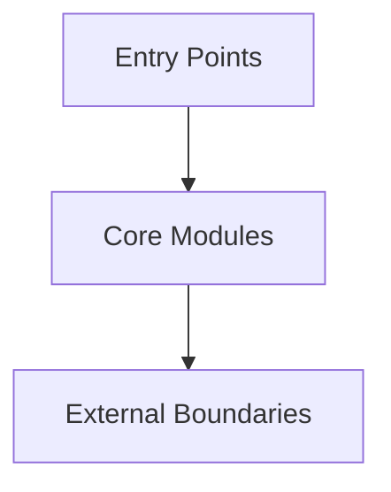
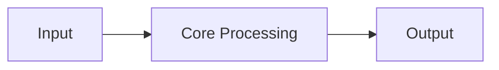

# Repo Overview

Build a structured mental model of this codebase. Do NOT dump file listings or generic descriptions. Focus on what a mid-level engineer needs to become productive.

## Input

The user provides one of:
- Nothing — analyze the entire repo
- A subsystem or directory to focus on
- A depth hint: `shallow` (quick scan, 2–3 minutes) or `deep` (thorough, 10+ minutes)

Default depth is **shallow** unless the user asks for deep. After producing the initial overview, ask if they want to dive deeper into any area.

## Process

### Step 0: Gauge Scale
Before starting, check the repo size:
- Count top-level directories and estimate total file count
- If the repo has **more than 500 source files or 10+ top-level packages**, state this upfront, produce only the top-level structure, and ask the user which subsystem to dive into
- If it's a monorepo, list the packages/workspaces first and wait for direction

### Step 1: Identify the Project Type
- What does this project do? (one sentence)
- What category? (library, CLI tool, web app, API service, monorepo, framework, plugin, etc.)
- What is the primary language and runtime?

### Step 2: Map the Architecture
Produce a layered summary:

- **Entry points**: Where does execution start? (main files, route definitions, CLI commands, event handlers)
- **Core modules**: The 3–5 most important directories or packages. For each: name, responsibility, and what it depends on.
- **Data flow**: How does data enter the system, get transformed, and exit? Describe the primary path in 3–5 steps.
- **External boundaries**: What external systems does this code talk to? (databases, APIs, queues, file systems, third-party services)
- **High-level diagrams**: Include concise architecture and flow diagrams. Prefer Mermaid when supported; otherwise use compact ASCII diagrams. Keep them at the component/module level, not class/function level.

For diagrams:
- Include one **architecture diagram** showing entry points, core modules, and external boundaries.
- Include one **primary flow diagram** showing the main happy-path flow through the system.
- Keep diagrams readable: roughly 5-9 nodes, simple labels, and only the most important arrows.
- For large repos where you stop early, include only a top-level architecture diagram and omit the flow diagram until the user picks a subsystem.

### Step 3: Start Here
Identify the **top 5 files a newcomer should read first**, in order. For each:
- File path
- Why this file matters (one line)
- What you'll understand after reading it

This is the most actionable section. Prioritize files that unlock the most understanding per time spent.

### Step 4: Identify Conventions
- Build system and key commands (build, test, lint, run)
- Naming patterns (file naming, module organization, test location)
- Configuration approach (env vars, config files, feature flags)
- Error handling pattern (exceptions, result types, error codes)

### Step 5: Contribution Context
If this is an open source project, note:
- Does CONTRIBUTING.md exist? Summarize the key process points.
- Are there coding standards or style guides mentioned?
- Are there any readings or resources recommended for newcomers? 
- What does the PR/review process look like? (CI checks, required reviewers, etc.)
- Skip this section for private/internal repos.

### Step 6: Flag What's Non-Obvious
- Anything surprising, unconventional, or likely to confuse a newcomer
- Hidden entry points or implicit behavior (decorators, code generation, reflection, DI containers)
- Known gotchas if apparent from the code structure

### Step 7: Hot Zones (deep only)
If depth is **deep**, identify recently active areas:
- Run `git log --oneline -50` or equivalent to find files changed most in recent commits
- Which modules are actively evolving vs. stable/legacy?
- Are there areas with high churn that suggest ongoing refactoring?

## Output Format

```
## Project: [name]
[One sentence: what it does]

## Scale
[X files, Y top-level modules. Monorepo: yes/no]

## Architecture
### Architecture Diagram


### Entry Points
- ...

### Core Modules
| Module | Responsibility | Key Dependencies |
|--------|---------------|-----------------|
| ...    | ...           | ...             |

### Data Flow
1. ...
2. ...

### Primary Flow Diagram


### External Boundaries
- ...

## Start Here
Read these files in order:
1. `path/to/file` — [why]
2. `path/to/file` — [why]
3. `path/to/file` — [why]
4. `path/to/file` — [why]
5. `path/to/file` — [why]

## Conventions
- Build: ...
- Tests: ...
- Config: ...
- Errors: ...

## Contribution (open source only)
- ...

## Non-Obvious
- ...

## Hot Zones (deep only)
- ...
```

## Rules

- Say "uncertain" if you cannot determine something from the code — do not guess.
- Prefer clarity over completeness. Omit a section rather than fill it with vague content.
- Do NOT list every file or directory. Focus on the 20% that explains 80% of the system.
- If this is a monorepo or large repo (500+ files), stop after the top-level map and ask the user to pick a subsystem. Do not try to analyze everything at once.
- The "Start Here" section is mandatory. If you can only produce one section, produce this one.
- Diagrams must stay high-level. Do not draw class-level or function-level graphs.
- If Mermaid is unavailable or likely unsupported, fall back to a small ASCII diagram instead of skipping diagrams.

## Example Usage

User: "I just cloned the Node.js repository. Give me a repo overview."

Expected output covers: Node.js is a JavaScript runtime built on V8, it's a large C++/JS monorepo (~2M lines), entry point is `src/node_main.cc` → `lib/internal/main/run_main_module.js`. Core modules include `src/` (C++ bindings), `lib/` (JS standard library), `deps/` (V8, libuv, OpenSSL). Start Here points to `lib/internal/modules/cjs/loader.js` (understand module loading), `src/node.cc` (bootstrap sequence), `lib/net.js` (see how a core module is structured). Conventions around `test/parallel/` vs `test/sequential/`, the `primordials` pattern for prototype pollution safety. Non-obvious: the `internalBinding()` bridge between JS and C++, the `internal/` prefix convention for non-public APIs.
